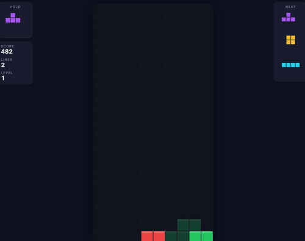

# Hi there! 👋 I'm Álvaro Diez

## About Me

I'm an **AI Platform / Engineer** specialized in **MLOps** passionate about Mathematics and Data Science working in BNP Paribas. I'm also a **Professor of Big Data** for the degree in Mathematics at UNIE University.

## Open Source & Projects

I love building fun, high-performance tools on the side:

### [pysuricata](https://github.com/alvarodiez20/pysuricata)
A lightweight **Exploratory Data Analysis** for Python, Built on Streaming Algorithms.
- **Goal**: Make data insights immediate. Minimal configuration, maximum insight.
- **Check it out!**: [Pysuricata EDA Report](https://alvarodiez20.github.io/pysuricata/assets/titanic_report.html) - [PySuricata Docs](https://alvarodiez20.github.io/pysuricata/)

### [Big Data Labs](https://github.com/alvarodiez20/bigdata)
Labs for my classes at UNIE.
- Hands-on labs with Spark, Hadoop, and distributed systems.
- **Check it out!**: [Big Data Cours Labs](https://alvarodiez20.github.io/bigdata/)

### [2048 - RL Agents & MPS Optimization](https://github.com/alvarodiez20/2048)
Training advanced Reinforcement Learning agents (DQN, CNN) to master 2048.
- **Tech**: Rust, WebAssembly, PyTorch (MPS/CUDA), Python
- **Play it now!** [alvarodiez20.github.io/2048/](https://alvarodiez20.github.io/2048/) (Mobile-ready with touch gestures!)

### [Tetris - Rust + WebAssembly with AI Opponents](https://github.com/alvarodiez20/tetris)
A modern Tetris built on a pure-Rust core engine compiled to WebAssembly, with SRS wall kicks, a 7-bag randomizer, hold, ghost piece, and combo/back-to-back scoring.
- **Tech**: Rust, WebAssembly (wasm-bindgen), Vite, TypeScript, Canvas
- **Play it now!** [alvarodiez20.github.io/tetris/](https://alvarodiez20.github.io/tetris/) (Desktop keyboard + mobile touch, with Smart & Random AI bots!)

## Tech Stack

### Core

### MLOps & Cloud

### AI & Big Data

## Education & Certs
- **MSc Industrial Mathematics** (Modeling Specialization) - UC3M
- **Deep Learning Specialization** & **ML Engineering for Production** - DeepLearning.AI

## Reach Out

- **LinkedIn**: [Alvaro Diez de Pablos](https://www.linkedin.com/in/alvarodiez20/)
- **GitHub**: [@alvarodiez20](https://github.com/alvarodiez20)

---
